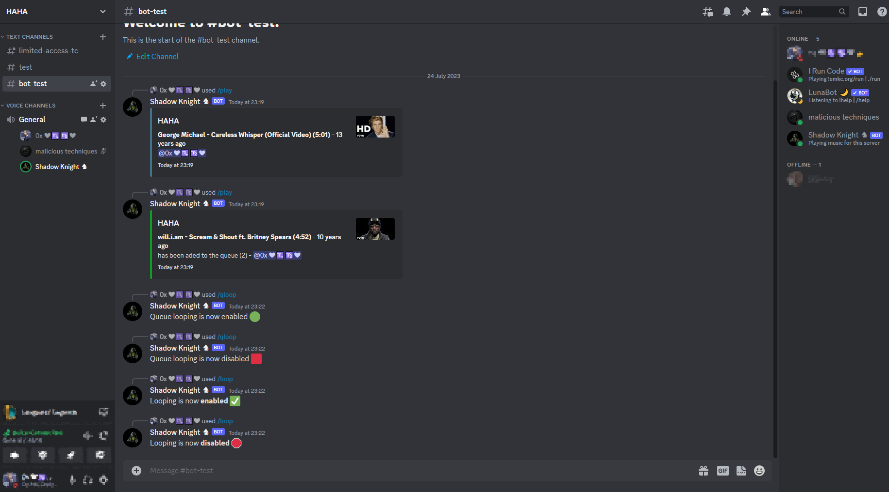

# Overview (Shadowknighty)

## What is it?
Shadowknighty is a bot to play your favourite music/audios on discord!

## How to get it started

Create your [discord application](https://discord.com/developers/docs/intro).

[npm install](https://docs.npmjs.com/cli/v8/commands/npm-install) - to install the dependencies

Configure your .env file accordingly. 

npm run start - to start the application

## Slash Commands & How to use

### /play [query]
Plays your favourite song! (creates a queue)

### /loop
Loops current audio.

### /qloop
Loops the queue.

### /skip
Skips to the next audio.

### /stop
Leaves the voice chat and refreshes the queue.
